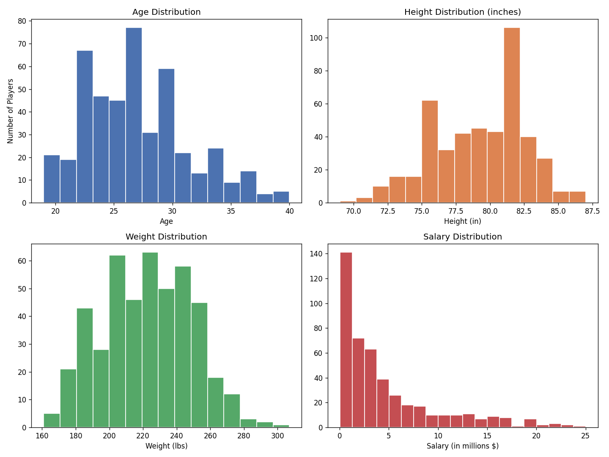
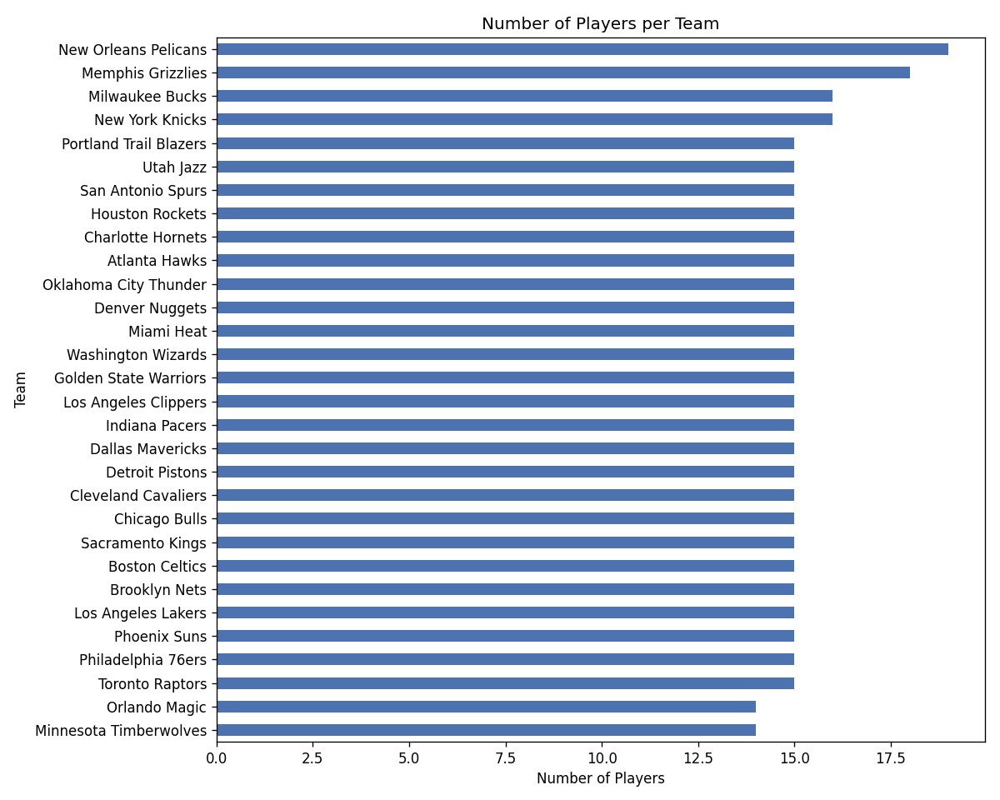
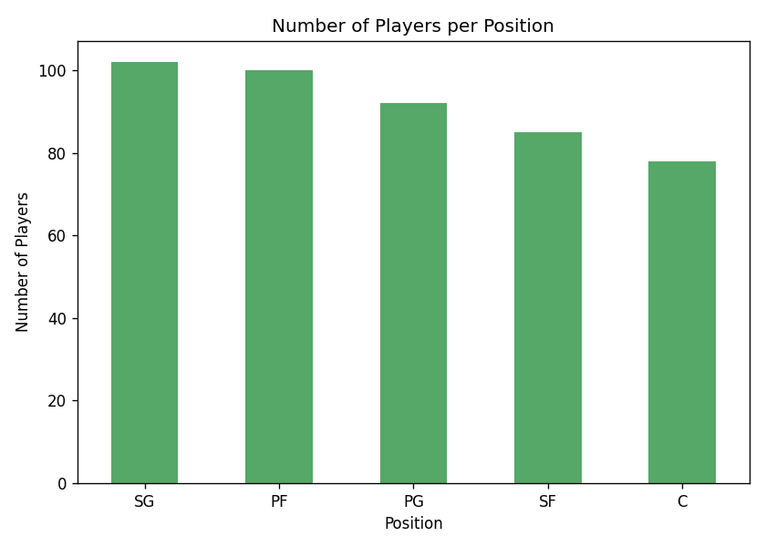
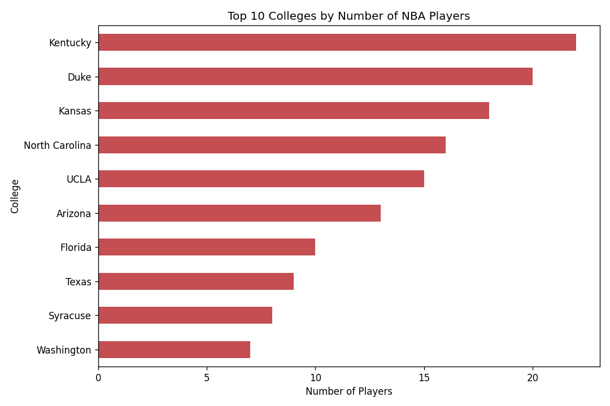
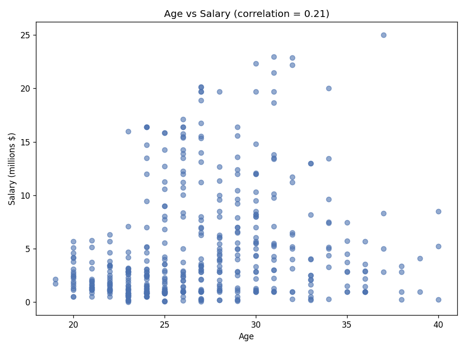
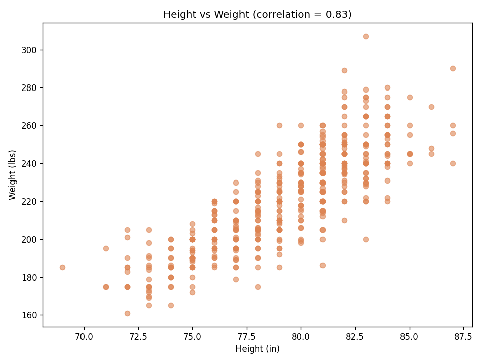
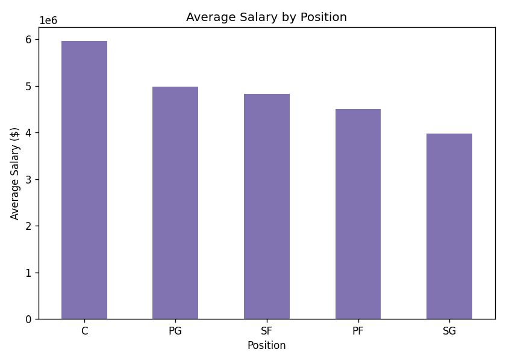
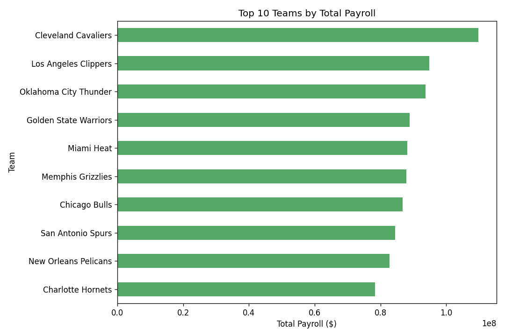
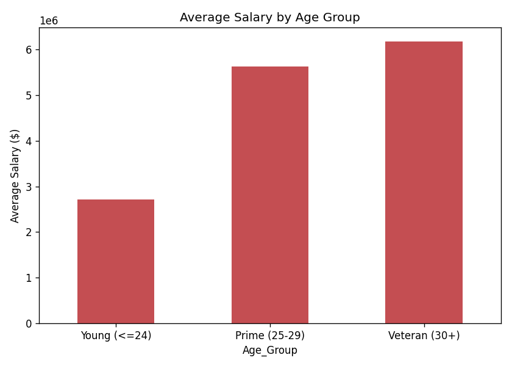

# NBA Players — Exploratory Data Analysis (EDA)

A beginner-to-intermediate Exploratory Data Analysis (EDA) project on an NBA players dataset using Python, NumPy, Pandas, and Matplotlib.

The project focuses on data cleaning, statistical analysis, visualization, and extracting meaningful insights from player and team data.

## What this project does

This project takes a raw CSV of 458 NBA players (name, team, position, age,
height, weight, college, salary) and answers real questions about the league:

- How are age, height, weight, and salary distributed among players?
- Which teams have the most players / the highest total payroll?
- Which positions earn the most on average?
- Is there a relationship between a player's age and their salary?
- Is there a relationship between height and weight?
- Which colleges send the most players to the NBA?

## Dataset

Source: GeeksforGeeks – NBA Dataset (nba.csv)

- Rows: 458
- Columns: 9

Features:
- Name
- Team
- Number
- Position
- Age
- Height
- Weight
- College
- Salary

## Why this dataset needed cleaning

Real-world data is never perfectly clean, and explaining *why* is part of
understanding the project:

| Issue | Why it happens | How it was handled |
|---|---|---|
| 1 fully blank row at the end of the file | Common artifact from CSV exports | Dropped with `dropna(how="all")` |
| Missing `Salary` values | Some players are on two-way / minimum / summer contracts not listed in this dataset's source | Filled with the **median** salary (median is used instead of mean because salary is right-skewed by a few very high earners — the mean would be distorted) |
| Missing `College` values | Some players went straight from high school to the NBA (common before the "one-and-done" rule), or are international players with no US college | Filled with the label `"None"` instead of dropped, so those players aren't lost from the analysis |
| `Height` stored as text like `"6-2"` | Feet-inches notation isn't numeric, so no math (averages, comparisons) can be done on it directly | Converted to a new column `Height_in` = total height in inches (`6-2` → 74) |

## Project structure

```
nba-eda-project/
├── NBA_EDA.ipynb          # Main analysis notebook (all code + charts + explanations)
├── Data
│   ├── nba.csv            # Raw dataset
├── images/                # Exported chart images (also embedded in the notebook)
│   ├── 01_univariate_distributions.png
│   ├── 02_players_per_team.png
│   ├── 03_players_per_position.png
│   ├── 04_top_colleges.png
│   ├── 05_age_vs_salary.png
│   ├── 06_height_vs_weight.png
│   ├── 07_avg_salary_by_position.png
│   ├── 08_top_team_payroll.png
│   └── 09_salary_by_age_group.png
├── requirements.txt
└── README.md
```

## 📊 Visualizations

The following visualizations were created using **Matplotlib** to explore player demographics, salary distribution, team composition, positional analysis, and relationships between numerical variables. These charts highlight the key findings of the exploratory data analysis.

### 1. Distribution of Age, Height, Weight, and Salary



Shows the distribution of the four numerical variables. Salary is highly right-skewed, while age, height, and weight have more balanced distributions.

---

### 2. Players per Team



Compares the number of players on each NBA team in the dataset.

---

### 3. Players by Position



Displays the number of players at each playing position.

---

### 4. Top Colleges Producing NBA Players



Shows which colleges have produced the highest number of NBA players in this dataset.

---

### 5. Age vs Salary



Illustrates the relationship between a player's age and salary. The trend suggests a weak positive correlation.

---

### 6. Height vs Weight



Demonstrates a strong positive relationship between height and weight.

---

### 7. Average Salary by Position



Compares the average salary earned by players in different positions.

---

### 8. Team Payroll



Shows the teams with the highest total payroll based on player salaries.

---

### 9. Average Salary by Age Group



Compares the average salary across different age groups to observe how earnings vary with age.

## How the analysis is organized (the notebook's 6 sections)

1. **Data Loading & Inspection** — load the CSV, check shape, dtypes, and
   count missing values per column with `.isnull().sum()`.
2. **Data Cleaning** — fix the height format, fill missing salaries/colleges
   (see table above).
3. **Univariate Analysis** — histograms of Age, Height, Weight, Salary, plus
   manual mean/median/std/variance calculations using `np.mean`, `np.median`,
   `np.std`, `np.var` (done manually with NumPy rather than only relying on
   `.describe()`, to practice the underlying statistics).
4. **Categorical Analysis** — bar charts for players per team, per position,
   and top colleges, using `.value_counts()`.
5. **Bivariate / Correlation Analysis** — scatter plots and `np.corrcoef` to
   quantify relationships (age vs salary, height vs weight), plus grouped
   averages (`.groupby()`) for salary by position, payroll by team, and
   salary by age bucket (using `pd.cut`).
6. **Key Insights Summary** — a written recap of what the numbers mean.

## Key findings

- **Salary is right-skewed**: a small number of star players earn far above
  the median, which is exactly why the median (not the mean) was used to
  fill missing salary values.
- **Age and Salary have a weak-to-moderate positive correlation (r ≈ 0.21)** —
  older players tend to earn somewhat more, likely reflecting experience and
  long-term contracts, but age alone doesn't explain most of the variation in pay.
- **Height and Weight are strongly correlated (r ≈ 0.83)** — unsurprising,
  since taller athletes generally carry more mass.
- **Centers (C) earn the most on average (~$5.97M)**, followed by Point
  Guards (~$4.98M), Small Forwards (~$4.83M), Power Forwards (~$4.51M), and
  Shooting Guards (~$3.98M) in this dataset.
- **The Cleveland Cavaliers, LA Clippers, and Oklahoma City Thunder** had the
  three highest total team payrolls in this snapshot of the data.


## How to run it

```bash
pip install -r requirements.txt
jupyter notebook NBA_EDA.ipynb
```

## Tools used

- **Pandas** — loading, cleaning, grouping, aggregating tabular data
- **NumPy** — numeric array operations, manual statistics, correlation
- **Matplotlib** — all charts (histograms, bar charts, scatter plots)
- **Jupyter Notebook** – Interactive development environment